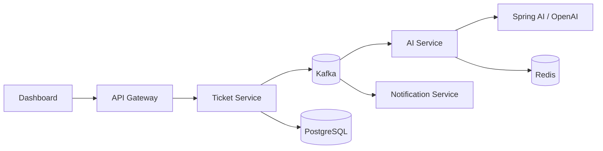

 

---

### About me

I'm **Gaurav** — a software engineer focused on **production-grade Java backends**: Spring Boot microservices, event-driven architectures, and operational tooling teams can run in real environments.

I care about the details that separate demos from systems you'd ship: async boundaries around slow APIs, caching and circuit breakers, structured LLM output, encrypted service layers, and dashboards that help operators see health and act quickly.

- 🔭 Currently building **[OpsConsole](https://github.com/gauravpv/OpsConsole)** — unified monitoring & admin for DevOps teams  
- 🧠 Recently shipped **[IntelliDesk](https://github.com/gauravpv/Intellidesk)** — AI ticket triage with Kafka, Redis, and Spring AI  
- 🛠️ Stack I reach for most: **Java 21 · Spring Boot 3 · Kafka · PostgreSQL · Redis · Docker**  
- 📫 Reach me: add your email or LinkedIn in [profile settings](https://github.com/settings/profile) (Website field works great for LinkedIn)

---

### Featured projects

| Project | What it does | Highlights |
|--------|----------------|------------|
| [**OpsConsole**](https://github.com/gauravpv/OpsConsole) | Enterprise DevOps operations dashboard | Health monitoring, SSH service control, RBAC, Azure AD, activity feed |
| [**IntelliDesk**](https://github.com/gauravpv/Intellidesk) | AI-powered support ticket triage | Spring AI structured output, Kafka pipeline, Redis cache, SSE live UI |
| [**UnifiedServiceLayer**](https://github.com/gauravpv/UnifiedServiceLayer) | Bureau / Dedupe caching API | AES-CBC envelopes, SHA-256 dedupe, MySQL, configurable downstream routing |

---

### Tech stack

  
  
  
  
  
  
  
  
  

---

### GitHub activity

  

---

### Architecture snapshot — IntelliDesk

---

**Thanks for stopping by — star a repo if something here is useful.**

